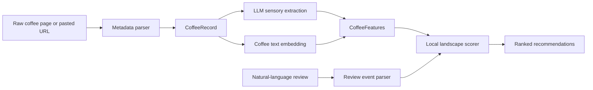

# Specialty Coffee Taste Engine

A Python recommendation engine for specialty coffee that turns product pages and natural-language reviews into ranked coffee recommendations.

The interesting bit is the preference model: instead of collapsing a user into one global taste profile, each reviewed coffee creates a local hill or valley in a sensory and semantic landscape. That lets the system handle context-dependent preferences, such as liking acidity in a clean washed coffee but not in a funky natural.

## What It Demonstrates

- Structured LLM extraction for product metadata, sensory vectors, and review intent.
- Embedding-based similarity combined with hand-auditable sensory features.
- A local landscape scoring model instead of a simple global preference vector.
- Typed Python data models, deterministic tests, and debug-friendly recommendation output.
- A Streamlit dashboard that supports both catalogue reviews and one-off pasted coffee URLs.

## System Flow



The persisted catalogue is built from saved raw coffee pages. Pasted URLs are processed through the same metadata, sensory, and embedding pipeline, but stay in memory and are not added to the recommendation database.

## Core Idea

The recommender models each review as local feedback around a specific coffee:

```text
liked coffee -> nearby coffees get a boost
disliked coffee -> nearby coffees are suppressed
change request -> reshape the local region
attribute opinion -> preserve or avoid a mentioned attribute level
```

For example:

```text
"I liked this coffee, but it was a little too acidic"
```

means:

```text
stay near this coffee's region
but prefer nearby candidates with lower acidity
```

It does not mean the user globally dislikes acidity.

## Build The Dataset

Create a `.env` file with:

```text
OPENAI_API_KEY=your_api_key_here
```

Then run:

```bash
python src/process_data/build_dataset.py
```

This writes:

```text
data/processed/coffees.csv
data/processed/coffee_sensory_vectors.csv
data/processed/coffee_embeddings.csv
```

To refresh embeddings without rerunning sensory extraction:

```bash
python src/process_data/build_embeddings.py
```

`coffee_sensory_vectors.csv` and `coffee_embeddings.csv` are required by the recommender. There is no offline sensory or embedding fallback in the canonical model.

## Streamlit Dashboard

Run:

```bash
streamlit run app.py
```

The dashboard supports two review flows:

- Choose a coffee from the processed catalogue.
- Paste a coffee product URL and review that one-off coffee without adding it to the catalogue.

After writing a review, the dashboard shows:

- the reviewed coffee representation
- the parsed review event
- ranked recommendations
- scoring debug output for each candidate

## Review Event Model

Reviews are parsed into structured events:

```python
{
    "coffee_id": "example-coffee-id",
    "overall": 0.75,
    "change_requests": {
        "acidity": {
            "direction": "lower",
            "strength": 0.35,
        }
    },
    "attribute_opinions": {
        "fruitiness": {
            "sentiment": "liked",
            "strength": 0.4,
        }
    },
}
```

Fields:

- `coffee_id`: the reviewed coffee.
- `overall`: from `-1.0` disliked to `1.0` liked.
- `change_requests`: explicit local requests for more or less of an attribute, such as "lower acidity" or "higher sweetness."
- `attribute_opinions`: attributes the user liked or disliked at this coffee's current level, such as "liked the roast level."

This distinction matters. "I wanted it sweeter" is a directional request. "I liked the sweetness" means preserve that coffee's sweetness level when comparing nearby candidates.

## Landscape Scoring

Each candidate coffee is scored against reviewed coffees:

```text
K(distance) = exp(-(distance^2) / temperature)

utility(candidate) =
  sum(review.overall * K(candidate, reviewed_coffee))
  - local change request penalties
  +/- attribute opinion adjustments
```

Coffee distance combines:

```text
0.55 * embedding distance
+ 0.35 * sensory distance
+ 0.10 * process distance
```

Kernel temperature is estimated from the catalogue using:

```text
neighbor_rank = max(2, round(sqrt(number_of_coffees)))
```

The model uses the median distance to that neighbor as the reference distance, then chooses temperature so:

```text
K(reference_distance) ~= 0.6
```

This keeps each review local while adapting naturally to catalogue size.

## Data Model

`coffees.csv` contains factual product metadata parsed from raw product pages:

```text
coffee_id
name
roaster
origin_country
process
variety
roast_level
tasting_notes
description
price
weight_g
brew_methods
```

`coffee_sensory_vectors.csv` contains LLM-inferred sensory attributes from `0.0` to `1.0`:

```text
acidity
sweetness
body
bitterness
fruitiness
chocolate_nutty
floral
funky_fermented
roasty
clean_cup
confidence
evidence
```

`coffee_embeddings.csv` contains semantic text embeddings generated from each coffee's name, origin, process, roast, tasting notes, and description.

## Minimal Usage

```python
from landscape import load_feature_index, recommend_from_landscape
from parse_review import parse_review_event

features = load_feature_index(
    "data/processed/coffees.csv",
    "data/processed/coffee_sensory_vectors.csv",
    "data/processed/coffee_embeddings.csv",
)

reviewed_coffee = features["example-coffee-id"]
event = parse_review_event(
    "I liked this coffee, but it was a little too acidic.",
    reviewed_coffee,
)

recommendations = recommend_from_landscape(features, [event], top_k=5)
```

Recommendation output includes:

```text
coffee_id
name
score
temperature
debug review contributions
distance breakdowns
change request penalties
attribute opinion adjustments
```

## Tests

Run:

```bash
pytest
```

Core tests cover:

- liked coffees boosting similar candidates
- disliked coffees suppressing similar candidates
- explicit change requests such as "too acidic"
- attribute opinions such as "liked the roast level"
- reviewed coffees being excluded from recommendations
- missing sensory vectors and embeddings failing loudly
- URL-reviewed coffees staying out of the persisted catalogue
- adaptive temperature using `max(2, round(sqrt(n)))`

## Current Limitations

- The canonical model depends on OpenAI API calls for sensory extraction, embeddings, and review parsing.
- Pasted URL support is designed for direct HTML product pages. JavaScript-heavy storefront pages may fail until a browser-rendered fetch path is added.
- One-off pasted coffees are intentionally not persisted or recommended back to the user.

## Next Steps

- Add multi-review session history in the dashboard.
- Add a 2D landscape visualization for recommendation debugging.
- Add browser-rendered URL extraction for JavaScript-heavy product pages.
