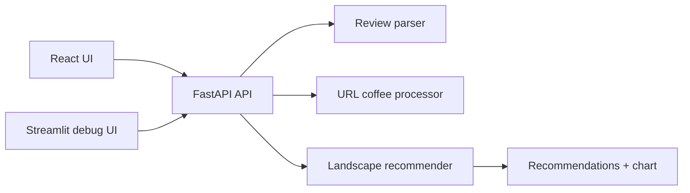

# Coffee Recommender

Turns reviewed coffees and short natural-language feedback into ranked recommendations.



## Run

```bash
uvicorn coffee_recommender.api:app --reload
cd frontend && npm install && npm run dev
streamlit run app.py
```

Set `OPENAI_API_KEY` in `.env` first.

Optional CORS override for the React frontend:

```text
COFFEE_RECOMMENDER_CORS_ORIGINS=http://localhost:5173,http://127.0.0.1:5173
```

The React app reads `VITE_API_BASE_URL` and defaults to `http://127.0.0.1:8000`.

## Data

Build the local catalogue:

```bash
.venv/bin/python -m coffee_recommender.process_data.build_dataset
```

Files produced:

```text
data/processed/coffees.csv
data/processed/coffee_sensory_vectors.csv
data/processed/coffee_embeddings.csv
```

Optional backend path overrides:

```text
COFFEE_RECOMMENDER_COFFEES_PATH=...
COFFEE_RECOMMENDER_SENSORY_PATH=...
COFFEE_RECOMMENDER_EMBEDDINGS_PATH=...
```

## API

- `GET /health`
- `GET /catalogue/coffees`
- `GET /review-session`
- `DELETE /review-session`
- `GET /review-session/landscape`
- `GET /reviewed-coffees/catalogue/{coffee_id}`
- `POST /reviewed-coffees/from-url`
- `POST /reviews/submit`

## Frontend

- `frontend/` contains the new React + TypeScript single-page app
- `app.py` remains available as the Streamlit debug interface
- the production-facing UI intentionally hides the raw debug payloads

## Checks

```bash
.venv/bin/python -m pytest
.venv/bin/python -m mypy src app.py
cd frontend && npm run build
```
