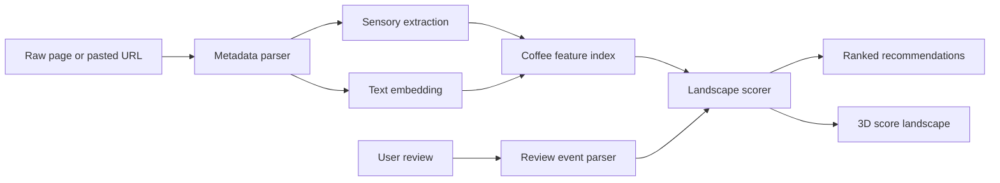

# Specialty Coffee Taste Engine

A Streamlit coffee recommender that turns product pages and natural-language reviews into ranked specialty coffee recommendations.

The model treats preference as a local landscape rather than a single global profile: each reviewed coffee creates a local signal in semantic, sensory, and process space. This keeps feedback contextual, so "too acidic" reshapes the area around that coffee instead of becoming a blanket rule.

## Highlights

- Parses coffee product pages into typed `CoffeeRecord` data.
- Uses LLMs for sensory extraction and structured review parsing.
- Combines coffee embeddings, sensory vectors, and process features for similarity.
- Supports stacked review history with no time decay.
- Supports one-off pasted coffee URLs without adding them to the recommendation catalogue.
- Includes an interactive 3D projected score landscape in the dashboard.

## System Flow



## Dashboard

Run:

```bash
streamlit run app.py
```

The dashboard lets you:

- review a catalogue coffee or paste a one-off coffee URL
- stack multiple reviews in one session
- inspect parsed review events and scoring debug output
- view recommendations on a projected 3D score landscape

## Review Events

Reviews are parsed into structured events:

```python
{
    "coffee_id": "example-coffee-id",
    "overall": 0.75,
    "change_requests": {
        "acidity": {"direction": "lower", "strength": 0.35}
    },
    "attribute_opinions": {
        "roasty": {"sentiment": "liked", "strength": 0.4}
    },
}
```

- `overall`: how much the user liked the coffee overall, from `-1.0` to `1.0`.
- `change_requests`: explicit requests for more or less of an attribute.
- `attribute_opinions`: attributes the user liked or disliked at the reviewed coffee's current level.

## Scoring Model

Each candidate is scored against all active review events:

```text
utility(candidate) =
  sum(review.overall * K(candidate, reviewed_coffee))
  - change request penalties
  +/- attribute opinion adjustments
```

Coffee distance combines:

```text
0.55 * embedding distance
+ 0.35 * sensory distance
+ 0.10 * process distance
```

The dashboard visualizer projects this high-dimensional coffee space into two PCA axes and plots score as height/color. It is an explanatory projection, not a replacement for the full scorer.

## Build Data

Create a `.env` file:

```text
OPENAI_API_KEY=your_api_key_here
```

Build the processed catalogue:

```bash
python src/process_data/build_dataset.py
```

Refresh embeddings only:

```bash
python src/process_data/build_embeddings.py
```

Generated files:

```text
data/processed/coffees.csv
data/processed/coffee_sensory_vectors.csv
data/processed/coffee_embeddings.csv
```

## Tests

```bash
pytest
```

Tests cover review parsing, landscape scoring, URL-reviewed coffees, multi-review state helpers, and data parsing.

## Type Checking

```bash
.venv/bin/python -m mypy
```

## Limitations

- Requires OpenAI API calls for sensory extraction, embeddings, and review parsing.
- Pasted URL support targets direct HTML product pages; JavaScript-heavy pages may fail.
- Pasted URL coffees are session-only and are not added to the persisted catalogue.
