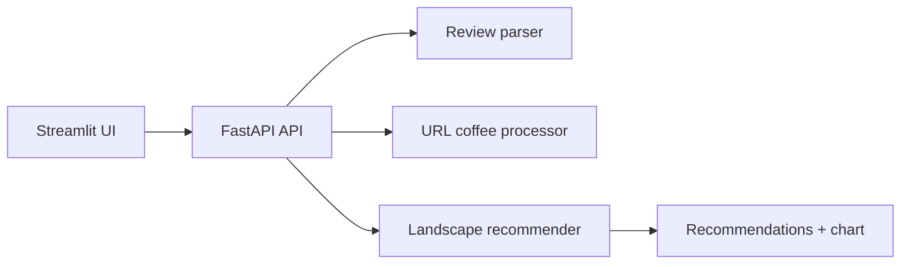

# Coffee Recommender

Turns reviewed coffees and short natural-language feedback into ranked recommendations.



## Run

```bash
uvicorn coffee_recommender.api:app --reload
streamlit run app.py
```

Set `OPENAI_API_KEY` in `.env` first.

## Data

Build the local catalogue:

```bash
.venv/bin/python -m coffee_recommender.process_data.build_dataset
```

Files produced:

```text
data/processed/coffees.csv
data/processed/coffee_sensory_vectors.csv
data/processed/coffee_embeddings.csv
```

Optional backend path overrides:

```text
COFFEE_RECOMMENDER_COFFEES_PATH=...
COFFEE_RECOMMENDER_SENSORY_PATH=...
COFFEE_RECOMMENDER_EMBEDDINGS_PATH=...
```

## API

- `GET /health`
- `GET /catalogue/coffees`
- `GET /catalogue/coffees/{coffee_id}`
- `POST /reviewed-coffee/url`
- `POST /reviews/submit`
- `POST /landscape`

## Checks

```bash
.venv/bin/python -m pytest
.venv/bin/python -m mypy src app.py
```
